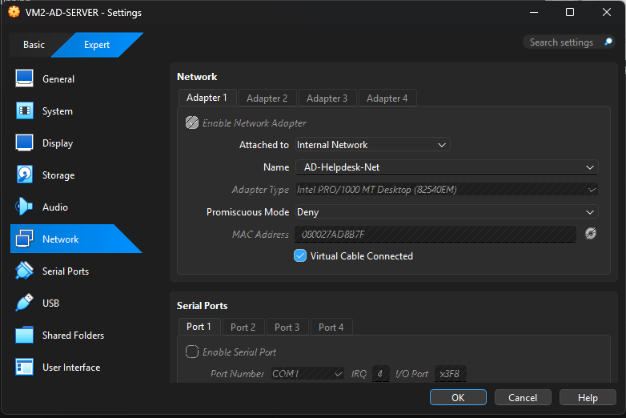
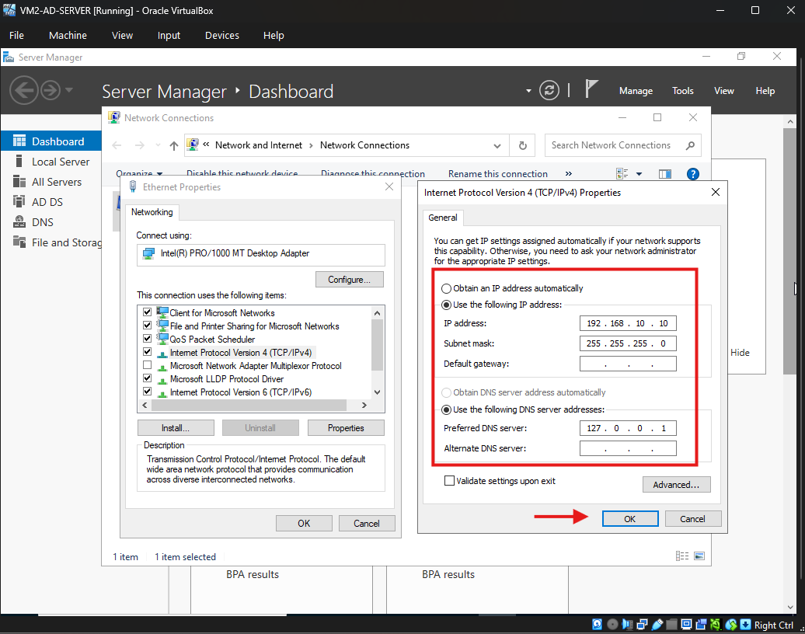
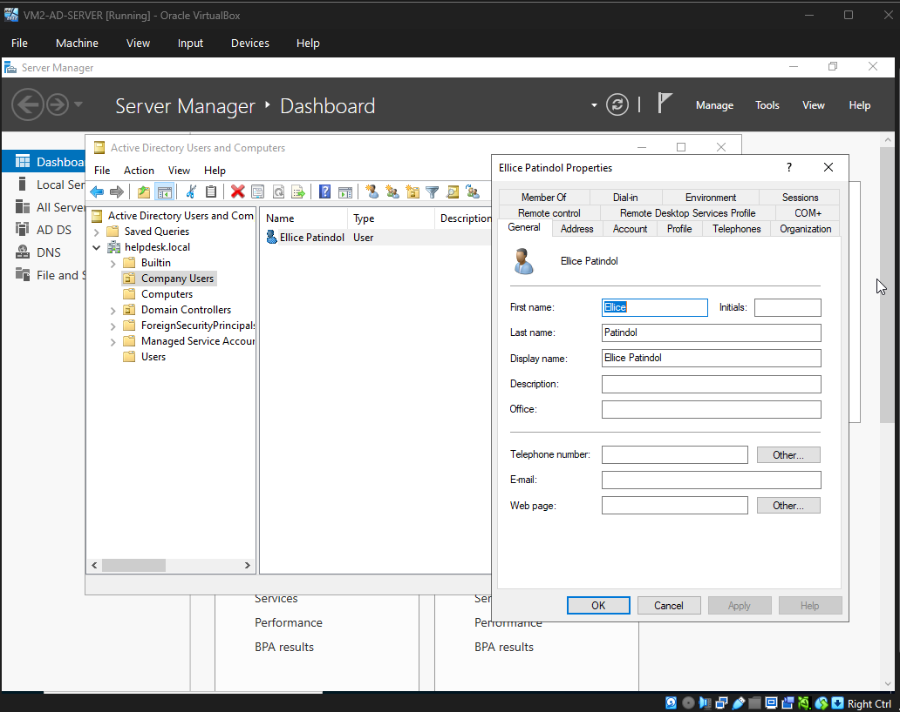

# Windows Server Active Directory & Client Workstation Home Lab
By: vermeerwork-ui

## 1. Project Overview & Objective
The objective of this project was to architect and deploy an isolated, enterprise-grade sandbox environment using Oracle VM VirtualBox. This lab serves as a hands-on training ground for simulating IT Helpdesk operations, systems administration workflows, and core infrastructure management. 

By deploying a Windows Server Domain Controller alongside a Windows 11 Client workstation on a dedicated internal virtual switch, I simulated real-world enterprise infrastructure to practice user lifecycle management, Group Policy deployments, and network troubleshooting.

---

## 2. Infrastructure Architecture & Network Design
To ensure complete isolation from my physical home network (preventing rogue DHCP/DNS issues), the environment utilizes an explicit **VirtualBox Internal Network**.

| Asset | Role | Operating System | Network Configuration | IP Address | DNS Server |
| :--- | :--- | :--- | :--- | :--- | :--- |
| **VM 2 (DC)** | Domain Controller / DNS | Windows Server 2022/2025 Standard (Desktop Experience) | Internal Network (`AD-Helpdesk-Net`) | `192.168.10.10` (Static) | `192.168.10.10` (Loopback) |
| **VM 3 (Client)**| Corporate Workstation | Windows 11 Pro | Internal Network (`AD-Helpdesk-Net`) | `192.168.10.50` (Static) | `192.168.10.10` (Points to DC) |

---

## 3. Step-by-Step Implementation Guide

### Phase 1: Deploying and Configuring VM 2 (The Domain Controller)

1. **Virtual Machine Creation:**
   * Initiated a new VM profile in VirtualBox named `Windows-Server-DC`.
   * Mounted the official Microsoft Windows Server Standard Evaluation ISO.
   * Allocated **4096 MB RAM** and **2 vCPUs** to guarantee reliable service operation.
   * Provisioned a **50 GB dynamically allocated virtual hard disk**.
   
2. **Virtual Switch Isolation:**
   * Navigated to VM Settings → **Network**.
   * Modified Adapter 1 from NAT to **Internal Network** and assigned the unique identifier string: `AD-Helpdesk-Net`.
   
   

3. **Operating System Installation:**
   * Booted the VM and selected the **Standard Evaluation (Desktop Experience)** tier to establish a Graphical User Interface (GUI).
   * Configured localized parameters and finalized the built-in local Administrator credentials upon completion.

4. **Network Interface Optimization (Static IP Mapping):**
   * Accessing `ncpa.cpl`, I targeted the virtual Ethernet adapter properties.
   * Stripped automatic addressing and hardcoded a fixed address topology:
     * **IP Address:** `192.168.10.10`
     * **Subnet Mask:** `255.255.255.0`
     * **Preferred DNS Server:** `192.168.10.10` (Self-referencing layout required for AD infrastructure initialization).
     
   

5. **Active Directory Domain Services (AD DS) Promotion:**
   * Launched **Server Manager** → **Add Roles and Features** → Checked **Active Directory Domain Services**.
   * Following the binary installations, invoked the promotion wizard to construct a root-level forest: `helpdesk.local`.
   * Assigned operational DSRM fail-safes and completed the automated deployment cycle.

---

### Phase 2: Deploying and Configuring VM 3 (The Windows 11 Corporate Client)

1. **Workstation Provisioning:**
   * Initiated a parallel VM matrix profile in VirtualBox named `Windows11-Client`.
   * Attached the official multi-edition Windows 11 ISO.
   * Hardened the system footprint layout allocating **4096 MB RAM** and **2 vCPUs** to meet Windows 11 architectural prerequisites.
   * Initialized a **50 GB virtual disk container**.

2. **Network Alignment:**
   * Mapped VM 3's network configuration precisely to the **Internal Network** tier named `AD-Helpdesk-Net`. This successfully locked both instances onto the exact same virtual layer-2 broadcast domain.

3. **IP Configurations:**
   * Logged into the localized Windows 11 desktop environment and altered network properties via control management parameters.
   * Overrode APIPA addressing defaults (`169.254.X.X`) with a customized subnet path configuration:
     * **IP Address:** `192.168.10.50`
     * **Subnet Mask:** `255.255.255.0`
     * **Preferred DNS Server:** `192.168.10.10` *(Crucial: Directed traffic directly to VM 2 so the client could actively locate and resolve the target domain controller).*

---

### Phase 3: Directory Architecture & Domain Interconnectivity

1. **Logical Enterprise Organization (OUs & Users):**
   * Inside VM 2, launched **Active Directory Users and Computers (ADUC)**.
   * Designed a root-tier Organizational Unit (OU) labeled `Company Users` to segment normal human capital from default administrative containers.
   * Created a practice identity object: `Ellice Patindol` (User Logon Name: `ElliceP`). Enabled the security flag: *User must change password at next logon*.

   

2. **Domain Ingestion (Joining VM 3 to helpdesk.local):**
   * Navigated to **Advanced System Settings** on VM 3 -> **Computer Name** -> **Change**.
   * Shifted membership from Workgroup to **Domain** and called: `helpdesk.local`.
   * Successfully passed the authentication check using domain administrator permissions (`HELPDESK\Administrator`).
   * Rebooted the client machine, successfully breaking the local isolation barrier and exposing the network to corporate network parameters.

   
   *Figure 1: Successful verification dialog box demonstrating the Windows 11 client resolving DNS and authenticating directly into the helpdesk.local environment.

---

## 4. Key Takeaways & Applied Helpdesk Competencies
Through this project, I engineered and mastered fundamental infrastructure layers critical to enterprise desktop support roles:
* **Network Isolation Principles:** Understanding layer-2 mapping via VirtualBox internal configurations.
* **Identity & Access Management (IAM):** Creating security structures, OUs, and implementing mandatory initial login security parameters.
* **DNS Resolution Mechanics:** Troubleshooting network endpoints by forcing endpoints to interact with targeted host address mappings.
